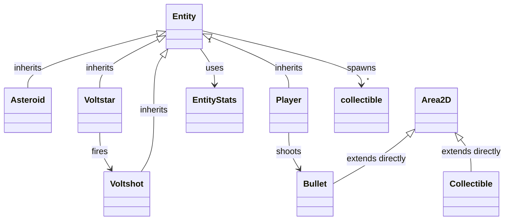

# Architecture

## Overview

AstroDodge is a 2D space survival game built in **Godot 4.7 (GL Compatibility)**. The game uses an autoload-driven architecture with a single scene tree and an Area2D-based entity system.

**Viewport:** 640×360, viewport stretch mode (integer), HDR 2D enabled.

---

## Autoloads (Singletons)

Four autoloads are registered in `project.godot`. They are always available globally.

| Name             | Path                          | Role                                                                   |
| ---------------- | ----------------------------- | ---------------------------------------------------------------------- |
| **Global**       | `globals/global.gd`           | Signals, enums, data save, fullscreen toggle, dev console toggle       |
| **AudioManager** | `audio/audio_manager.tscn`    | SFX + music playback with randomized pitch and tween fade in/out       |
| **DevConsole**   | `globals/dev_console.tscn`    | Debug console (visible only in debug builds)                           |
| **Preloader**    | `states/loading/preloader.gd` | Loading screen + GPU warmup (script-only autoload, frees UI after use) |

### Global (`globals/global.gd`)

Central hub. Exposes:

- **Signals:** `change_state`, `show_popup`, `quit_game`, `trigger_camera_shake`, `explosion_occurred`, `item_collected`, `pause_toggled`
- **Enums:** `GameState {MAIN_MENU, GAMEPLAY}`, `CollectibleType {J_UNIT, CAP_UNIT, DDRX_CHIP, M2_CHIP, ASM_UNIT}`
- **Data:** `data_save: DataSave` — persisted collectible counts via `ResourceSaver`
- **State tracking:** `current_state`, `current_world`, `current_gui`
- **Input:** Fullscreen toggle (F11), dev console toggle (backtick — debug only)

Save data lives at `user://data_save.res` as `DataSave extends Resource` with a `collectibles_counter: Array[int]`.

### AudioManager (`audio/audio_manager.gd`)

- Two audio players: `sfx` (polyphonic, max 4) and `music` (single instance)
- **SFX:** HOVER, CLICK, LOSE, BOOM, SHOOT, PICKUP — each loaded as exported `AudioStreamWAV`, played with randomized pitch (0.8–1.2) via `RandomNumberGenerator`
- **Music:** Two separate `AudioStreamWAV` tracks (`main_menu_music.wav`, `gameplay_music.wav`), with linear fade in/out via Tweens. Loop behaviour is determined by the WAV file's embedded loop metadata ("Detect From File" import mode).
- API: `play_sfx(type, volume)`, `play_music(type)`, `stop_music()`

### DevConsole

- Toggled with backtick (debug builds only via `OS.is_debug_build()`)
- Text input for executing exposed methods (auto-complete), output display for results
- History navigation with Up/Down arrows
- Commands: `modify_hp`, `game_over`, `destroy_all_asteroids`, `destroy_all_enemies`, `reload`, `reload_current_state`, `shake_camera`, `pause`, `clear`, `help`, `quit`

### Preloader (`states/loading/preloader.gd`)

- Script-only autoload (`extends Node`, no class_name) — no permanent scene tree overhead
- Manages loading screen display during initial startup
- Instantiates `loading_screen.tscn` on-demand during `preload_all()`, frees it after completion
- Performs GPU warmup (creates/destroys placeholder objects in a hidden `_WarmingRoot` node) to avoid shader compile hitches during gameplay
- Sets `Global.current_world = _WarmingRoot` during warmup — consumers must guard against this

---

## Scene Tree

```text
Root (Node)
├── Main (Node)               # Root scene controller, manages state transitions
│   ├── BG (CanvasLayer)       # Background layer (black ColorRect)
│   ├── World (CanvasLayer)    # Entity spawning area (Node2D child)
│   ├── FX (CanvasLayer)       # Shader overlays (SpaceWarp ColorRect)
│   ├── GUI (CanvasLayer)      # HUD, menus
│   ├── Popups (CanvasLayer)   # Modal popups (quit confirmation)
│   ├── Transitions (CanvasLayer)  # Dissolve transition effects
│   └── Overlays (CanvasLayer) # VHS CRT overlay shader
├── Global (Node)              # Autoload — signals, data, state
├── AudioManager (Node)        # Autoload — SFX + music
├── DevConsole (CanvasLayer)   # Autoload — debug console
└── Preloader (Node)           # Autoload — preload_all orchestrator (frees LoadingScreen view after use)
```

The `Root → Main` subtree is reconstructed on state changes via the `change_state` signal. Autoloads persist across state transitions.

---

## Entity System

Most game entities inherit from `Entity` (extends `Area2D`). `Bullet` and `Collectible` extend `Area2D` directly.



### Entity Lifecycle

1. **Spawn** — instantiated by `EntitySpawner` or scene tree
2. **Active** — moves via `_move(delta)`, takes damage via `_be_hurt()`, interacts via `_on_area_entered`
3. **Death** — `_die()` → re-entrancy guard → explosion particles + camera shake → await cleanup timer → `queue_free`

### Damage Flow

```text
area_entered → _on_area_entered (group filter) → _be_hurt(damage) → _hp setter → clamp check
    ├─ hp > 0 → camera shake (hit_shake_intensity), continue
    └─ hp ≤ 0 → _die() → explosion particles → cleanup timer → queue_free
```

Player overrides `_be_hurt()` to add invulnerability frames, red flash, and `is_hurt`/`is_dead` signals.

### Collectibles

Spawned by `Entity._spawn_collectibles(type, min, max)`. Five types from `CollectibleType` enum. Only `J_UNIT` is currently connected to spawning logic (from Voltstar destruction). Collectibles accelerate toward the player on contact and persist counts via `DataSave`.

| Type                                   | Status                                                |
| -------------------------------------- | ----------------------------------------------------- |
| J-Unit (Joule)                         | Spawned by Voltstar death, fully tracked              |
| Cap-unit, DDRx-chip, M2-chip, ASM-unit | Exported as PackedScenes, no spawning logic connected |

---

## Physics Layers

Six physics layers configured in `project.godot`:

| Layer | Name           | Value | Used By                        |
| ----- | -------------- | ----- | ------------------------------ |
| 1     | `player`       | 1     | Player ship                    |
| 2     | `enemies`      | 2     | Asteroids, Voltstars           |
| 3     | `weapons`      | 4     | Bullets (friendly projectiles) |
| 4     | `anti_weapons` | 8     | Voltshots (enemy projectiles)  |
| 5     | `collectibles` | 16    | Pickup items                   |
| 6     | `statics`      | 32    | Overcharge stations            |

Collision is handled via `area_entered` signals on `Area2D` nodes, not `body_entered`.

---

## Input

| Action         | Key         | Function                                                |
| -------------- | ----------- | ------------------------------------------------------- |
| `primary`      | Left mouse  | Shoot                                                   |
| `secondary`    | Right mouse | Toggle auto-fire                                        |
| `up`           | W / Up      | Move forward / Resume from pause / Restart on game over |
| `down`         | S / Down    | Move backward                                           |
| `left`         | A / Left    | Rotate left                                             |
| `right`        | D / Right   | Rotate right                                            |
| `back`         | Escape      | Toggle pause / Return to menu on pause or game over     |
| `full_screen`  | F11         | Toggle fullscreen                                       |
| `_dev_console` | Backtick    | Toggle console (debug builds only)                      |

Player rotation is mouse-aimed (angle to cursor). Movement is forward/backward relative to ship heading, controlled by Up/Down.

---

## State Management

Two states via `Global.GameState` enum:

1. **MAIN_MENU** — title screen with animated logo, New Game / Settings / Quit buttons. Settings and Upgrades buttons are disabled (placeholder).
2. **GAMEPLAY** — active world with entity spawning (Asteroids, Voltstars), scoring, HP bar, speed bar, collectible counter, pause support.

Transitions use a dissolve shader effect (`_transition_in` → fade to black, `_transition_out` → fade in). The `_is_transitioning` flag prevents re-entry during an active transition. The same-state guard was removed to allow game-over restart through the full dissolve.

---

## Groups

Registered in `project.godot` for broad queries:

| Group          | Description                                            |
| -------------- | ------------------------------------------------------ |
| `enemies`      | Entities doing damage to Player (asteroids, voltstars) |
| `entities`     | All moving objects in Gameplay state                   |
| `player`       | The main controllable entity                           |
| `asteroids`    | Asteroid entities                                      |
| `bullets`      | Player-fired projectiles                               |
| `voltshot`     | Enemy-fired projectiles                                |
| `voltstars`    | Voltstar enemies                                       |
| `collectibles` | Pickup items                                           |
| `statics`      | Static non-moving objects                              |

---

## File Structure

```text
res://
├── addons / AsepriteWizard   # Editor plugin
├── audio /                    # AudioManager + music + sfx assets
├── components /               # Reusable node components (AnimationComponent)
├── docs /                     # Documentation (stale, see Obsidian vault)
├── entities /                 # All game entities
│   ├── asteroid /
│   ├── bullet /               # Player projectiles (extends Area2D directly)
│   ├── collectibles /         # Pickup scenes per type
│   ├── entity.gd              # Base class (Area2D)
│   ├── entity_spawner /       # Spawner scenes + script
│   ├── entity_stats /         # Resource class for entity stats
│   ├── player /
│   ├── static /               # Static interactive objects
│   └── voltstar /
│       └── voltshot /
├── fonts /
├── globals /                  # Global, DevConsole, DataSave
├── states /                   # MainMenu, Gameplay (and GUI subdir), Loading
├── themes /                   # Theme + font resources
├── transitions /              # Dissolve transition scene
├── visuals /                  # Cursors, shaders, sprite sheets, particles
```
