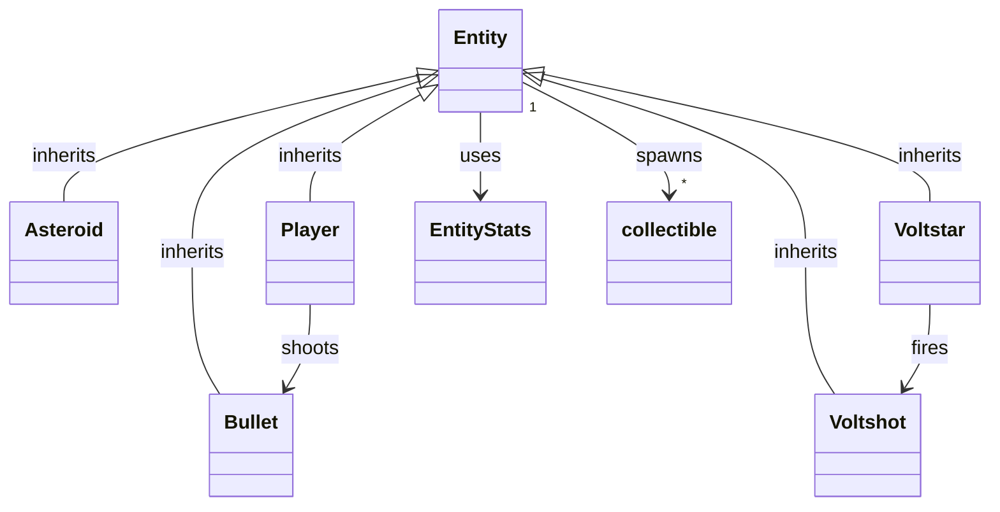

# Architecture

## Overview

AstroDodge is a 2D space survival game built in **Godot 4.7 (GL Compatibility)**. The game uses a lightweight autoload-driven architecture with a single scene tree and an Area2D-based entity system.

**Viewport:** 640×360, viewport stretch mode, HDR 2D enabled.

---

## Autoloads (Singletons)

Four autoloads are registered in `project.godot`. They are always available globally.

| Name             | Path                       | Role                                                             |
| ---------------- | -------------------------- | ---------------------------------------------------------------- |
| **Global**       | `globals/global.gd`        | Signals, enums, data save, fullscreen toggle, dev console toggle |
| **AudioManager** | `audio/audio_manager.tscn` | SFX + music playback with randomization and fade in/out          |
| **DevConsole**   | `globals/dev_console.tscn` | Debug console (visible only in debug builds)                     |
| **Preloader**    | `states/loading/loading_screen.gd` | Loading screen + GPU warmup (instantiated scene freed after use) |

### Global (`globals/global.gd`)

Central hub. Exposes:

- **Signals:** `change_state`, `show_popup`, `quit_game`, `trigger_camera_shake`, `explosion_occurred`, `item_collected`
- **Enums:** `GameState {MAIN_MENU, GAMEPLAY}`, `CollectibleType {J_UNIT, C_UNIT, DDX6_CHIP, MX3_CHIP, ASM_UNIT}`
- **Data:** `data_save: DataSave` — persisted collectible counts via `ResourceSaver`
- **State tracking:** `current_state`, `current_world`, `current_gui`
- **Input:** Fullscreen toggle (F11), dev console toggle (backtick — debug only)

Save data lives at `user://data_save.res` as a custom `Resource` (`DataSave extends Resource`) with a single `collectibles_counter: Array[int]`.

### AudioManager (`audio/audio_manager.gd`)

- Two audio players: `sfx` (one-shot) and `music` (looping)
- **SFX:** HOVER, CLICK, LOSE, BOOM, SHOOT — each loaded as exported AudioStreamWAV, played with randomized pitch (0.8–1.2)
- **Music:** Single gameplay track as AudioStreamOggVorbis, with linear fade in/out via Tweens
- API: `play_sfx(type, volume)`, `play_music(type)`, `stop_music()`

### DevConsole

- Toggled with backtick (debug builds only via `OS.is_debug_build()`)
- Text input field for executing commands, output display for results
- Auto-focuses input on open

### Preloader (`states/loading/loading_screen.gd`)

- Script-only autoload (`extends Node`) — no permanent scene tree overhead
- Manages loading screen display during initial startup
- Instantiates `loading_screen.tscn` on-demand during `preload_all()`, frees it after completion
- Performs GPU warmup (creates/destroys placeholder objects) to avoid shader compile hitches during gameplay

---

## Scene Tree

```text
Root (Node)
├── Main (Node2D)          # Active game state container
│   ├── BG (Node2D)
│   ├── World (Node2D)     # Entity spawning area
│   ├── GUI (Control)      # HUD, menus
│   ├── Popups
│   ├── Transitions
│   └── Overlays
├── Global (Node)          # Autoload — signals, data, state
├── AudioManager (Node)    # Autoload — SFX + music
├── DevConsole (Control)   # Autoload — debug console
└── Preloader (Node)       # Autoload — LoadingScreen (script-only, frees UI after use)
```

The `Root → Main` subtree is swapped out on state changes (`Global.change_state` signal). The autoloads persist across state transitions.

---

## Entity System

All game entities inherit from `Entity` (extends `Area2D`). Data is separated via `EntityStats` (extends `Resource`).



### Entity Lifecycle

1. **Spawn** — instantiated by spawner or scene tree
2. **Active** — moves, takes damage, interacts via `_on_area_entered`
3. **Death** — `_die()` → spawns collectibles (if applicable) → plays explosion particles + audio → queue_free

### Damage Flow

```text
Collision → _on_area_entered → _be_hurt(damage) → hp check
    ├─ hp > 0  → i-frame period, camera shake, hit particles
    └─ hp ≤ 0  → _die() → collectible spawn → explosion → remove
```

### Collectibles

Spawned by `Entity._spawn_collectibles(type, min, max)`. Five types from `CollectibleType` enum:

| Type               | Behavior                                      |
| ------------------ | --------------------------------------------- |
| J-Unit (Joule)     | Temporary overcharge of weapon/engine         |
| C-Unit (Capacitor) | Permanent component upgrade                   |
| DDx6-chip (DDR6)   | Temporary system storage                      |
| Mx3-chip (M.2)     | Permanent storage / skill tree                |
| .asm-unit          | Add new function to system (requires storage) |

---

## Physics Layers

Six physics layers configured in `project.godot`:

| Layer | Name           | Used By                              |
| ----- | -------------- | ------------------------------------ |
| 1     | `player`       | Player ship                          |
| 2     | `enemies`      | Asteroids, Voltstars, enemies        |
| 3     | `weapons`      | Bullets, Voltshots (player-friendly) |
| 4     | `anti_weapons` | Enemy projectiles                    |
| 5     | `collectibles` | Pickup items                         |
| 6     | `statics`      | Overcharge stations, walls           |

Collision is handled via `area_entered` signals on `Area2D` nodes, not `body_entered`.

---

## Input

| Action               | Key           | Function               |
| -------------------- | ------------- | ---------------------- |
| `primary`            | Left mouse    | Shoot                  |
| `secondary`          | Right mouse   | (Reserved)             |
| `up/down/left/right` | WASD / Arrows | Movement               |
| `full_screen`        | F11           | Toggle fullscreen      |
| `_dev_console`       | Backtick      | Toggle console (debug) |

Player rotation is mouse-aimed (angle to mouse cursor). Movement is WASD relative to screen axes.

---

## State Management

Two states via `Global.GameState` enum:

1. **MAIN_MENU** — title screen, settings, transitions into GAMEPLAY
2. **GAMEPLAY** — active world with entity spawning, HUD, pause support

Transitions between states use the `change_state` signal. The `Main` scene is swapped or reconfigured accordingly. Death triggers a grainy dissolve transition before respawn or game over.

---

## Groups

Registered in `project.godot` for broad queries:

`enemies`, `player`, `asteroids`, `entities`, `bullets`, `voltshot`, `collectibles`, `voltstars`, `statics`

---

## File Structure

```text
res://
├── addons / AsepriteWizard   # Editor plugin
├── audio /                    # AudioManager + assets
├── collectibles /             # Pickup scenes per type
├── components /               # Reusable node components
├── docs /                     # Documentation
├── entities /                 # Player, Asteroid, Bullet, Voltstar, Voltshot
├── fonts /
├── globals /                  # Global, DevConsole, DataSave
├── states /                   # MainMenu, Gameplay (and GUI subdir)
├── statics /                  # OverchargeStation
├── themes /                   # Theme + font resources
├── transitions /              # Screen transition effects
└── visuals /                  # Cursors, shaders
```
