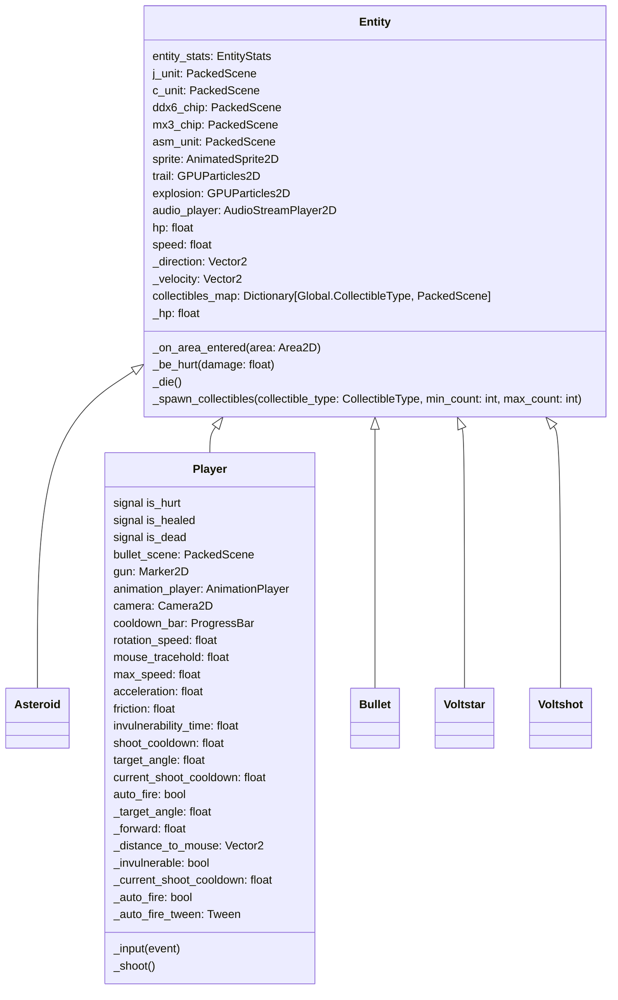
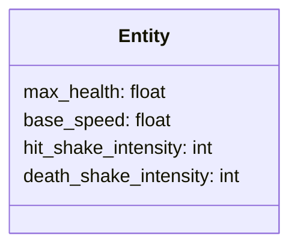
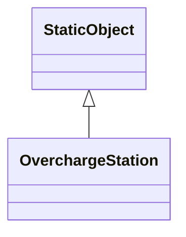

# Classes

## Entity

extends Area2D

```mermaid
classDiagram
    Entity <|-- Asteroid
    Entity <|-- Player
    Entity <|-- Bullet
    Entity <|-- Voltstar
    Entity <|-- Voltshot
    class Entity{
        entity_stats: EntityStats

        j_unit: PackedScene
        c_unit: PackedScene
        ddx6_chip: PackedScene
        mx3_chip: PackedScene
        asm_unit: PackedScene

        sprite: AnimatedSprite2D
        trail: GPUParticles2D
        explosion: GPUParticles2D
        audio_player: AudioStreamPlayer2D

        hp: float
        speed: float

        _direction: Vector2
        _velocity: Vector2
        collectibles_map: Dictionary[Global.CollectibleType, PackedScene]
        _hp: float

        _on_area_entered(area: Area2D)
        _be_hurt(damage: float)
        _die()
        _spawn_collectibles(collectible_type: CollectibleType, min_count: int, max_count: int)
    }
    class Player{
        signal is_hurt
        signal is_healed
        signal is_dead

        bullet_scene: PackedScene
        gun: Marker2D
        animation_player: AnimationPlayer
        camera: Camera2D
        cooldown_bar: ProgressBar

        rotation_speed: float
        mouse_tracehold: float
        max_speed: float
        acceleration: float
        friction: float

        invulnerability_time: float
        shoot_cooldown: float

        target_angle: float
        current_shoot_cooldown: float
        auto_fire: bool

        _target_angle: float
        _forward: float
        _distance_to_mouse: Vector2
        _invulnerable: bool
        _current_shoot_cooldown: float
        _auto_fire: bool
        _auto_fire_tween: Tween

        _input(event)
        _shoot()
    }
    class Asteroid{

    }
    class Bullet{

    }
    class Voltstar{

    }
```

## EntityStats

extends Resource

```mermaid
classDiagram
    class Entity{
        max_health: float
        base_speed: float
        hit_shake_intensity: int
        death_shake_intensity: int
    }
```

## StaticObject

extends Area2D

```mermaid
classDiagram
    StaticObject <|-- OverchargeStation
    class StaticObject {
        
    }
    class OverchargeStation {
        
    }
```
