# Classes

## Entity

extends Area2D. Base class for moving entities. Provides hp, movement, death effects (explosion particles, camera shake), and collectible spawning.

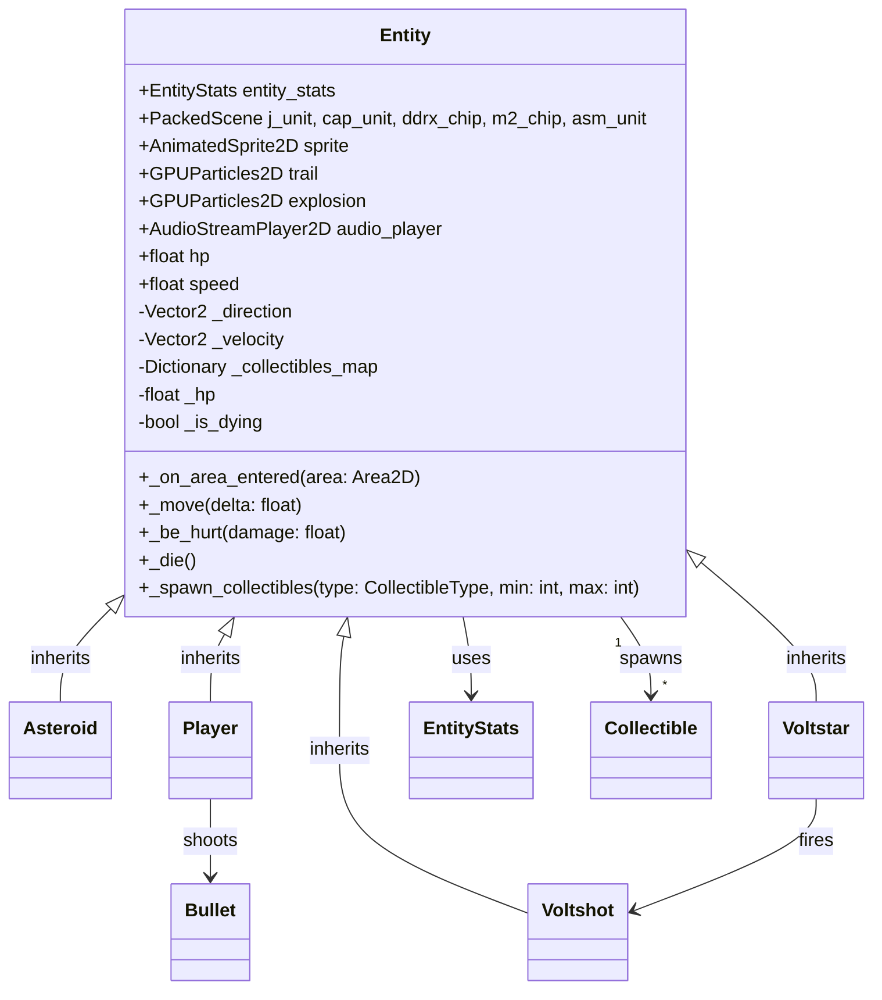

### Player

extends Entity. Player-controlled ship. Moves toward the mouse, shoots bullets, enters invulnerability on hit, emits `is_hurt`/`is_healed`/`is_dead` signals.

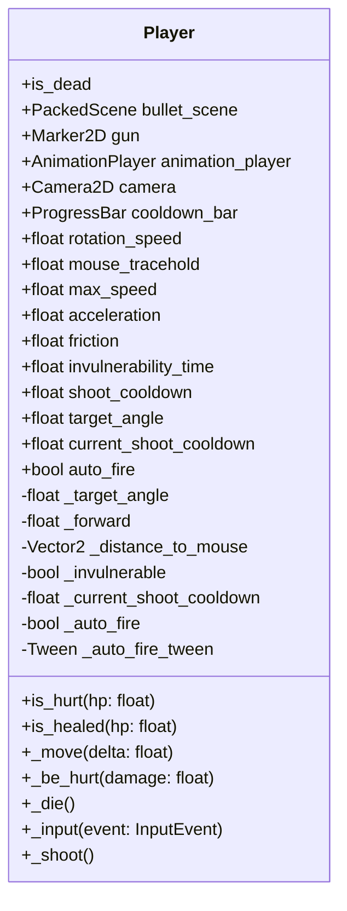

### Asteroid

extends Entity. Drifts toward the player with randomized drift angle. Explodes into shatter particles on death. Size varies (scale 1.0–4.0) — particle velocity and amount scale proportionally.

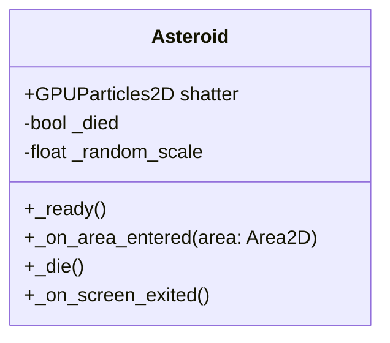

### Voltstar

extends Entity. Orbiting enemy that maintains a fixed distance from the player. Fires Voltshot projectiles on a 5s timer. Drops J-unit collectibles on destruction by player bullets. Uses perpendicular repulsion to prevent overlap with other Voltstars.

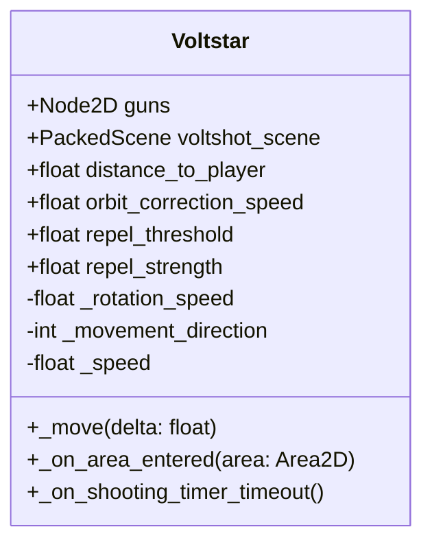

### Voltshot

extends Entity. One-shot homing projectile fired by Voltstars. Rotates toward the player and self-destructs on contact or after a 5s lifetime timeout.

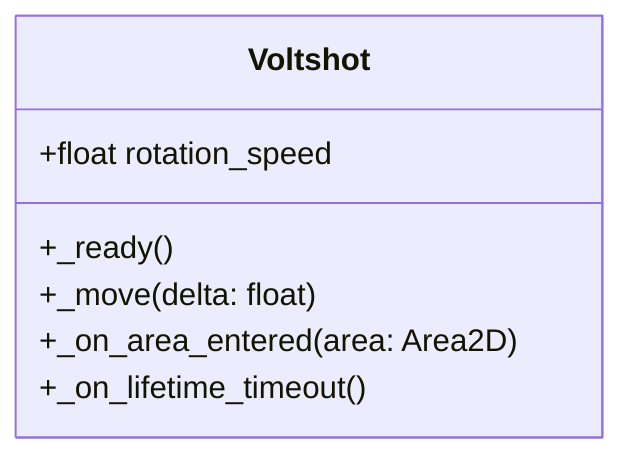

---

## Direct Area2D classes (no Entity inheritance)

### Bullet

extends Area2D. Lightweight projectile fired by the Player. Flies forward and cleans up on enemy contact or when off-screen.

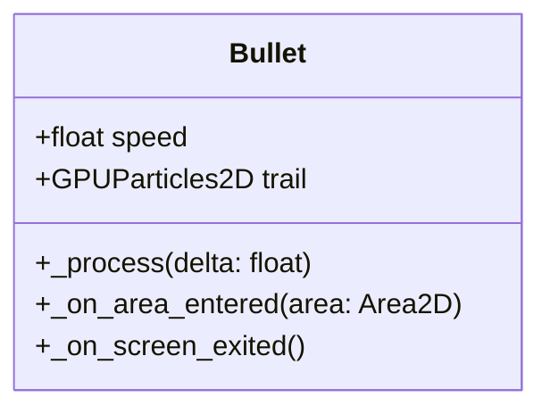

### Collectible

extends Area2D. Accelerates toward the player on spawn. On pickup, increments the counter for its type and persists it via `DataSave`.

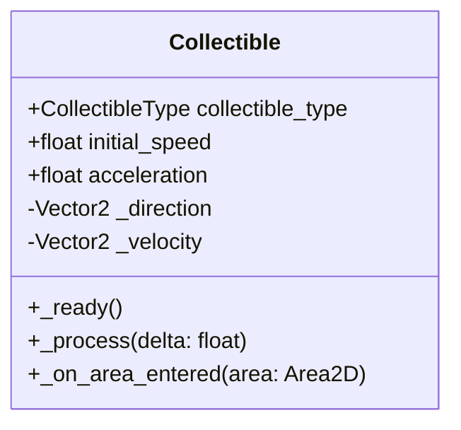

---

## Other classes

### EntityStats

extends Resource. Defines an entity's stats: health, speed, camera shake intensities.

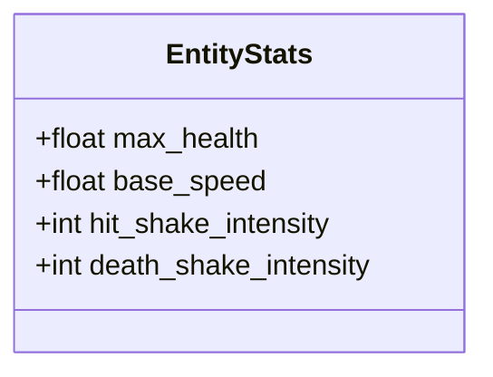

### EntitySpawner

extends Timer. Timer-based spawner that places entities just outside the camera viewport. Respects a per-spawner max count and spreads batches across frames to avoid spikes.

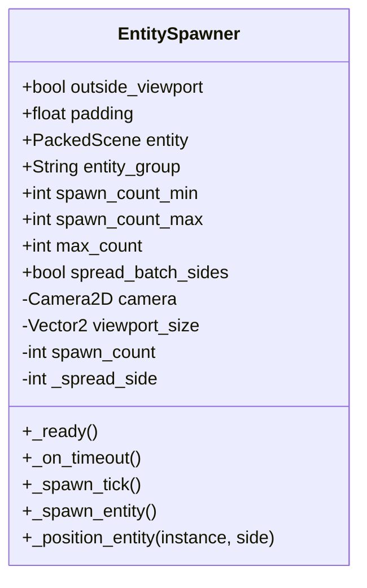

### StaticObject

extends Area2D. Base class for non-moving interactive objects. Currently a bare skeleton with no behaviour (empty `_ready()` and `_process()` overrides).

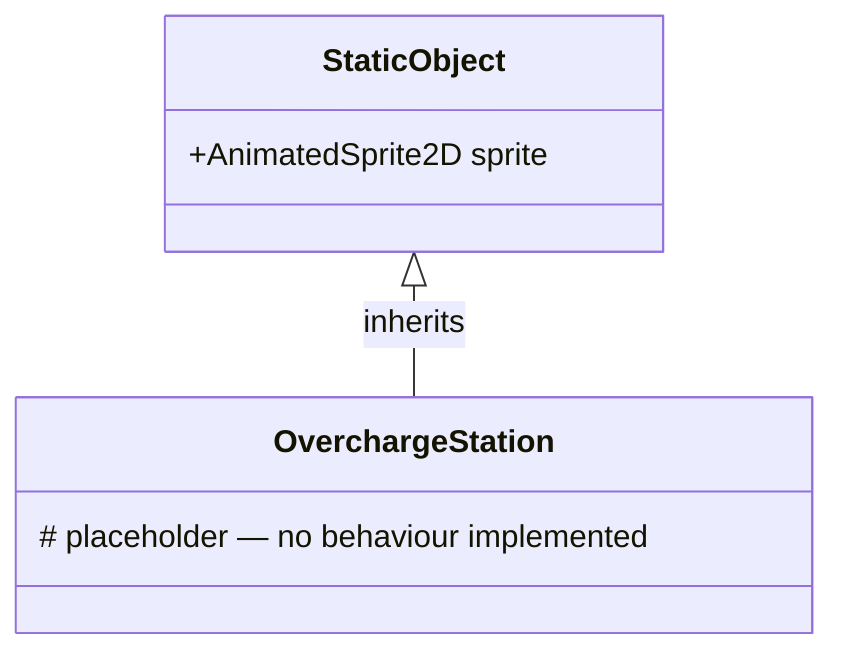

### DataSave

extends Resource. Serializable resource for persistent collectible counters. Saved/loaded via `ResourceSaver`/`ResourceLoader`.

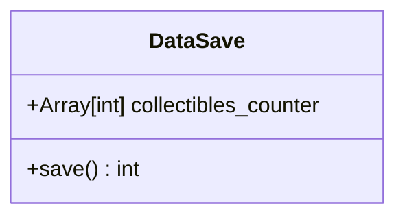

### AnimationComponent

extends Node. Button animation helper: hover/press scaling, font swap, click SFX, idle rotation wobble. Attach as child of a Button.

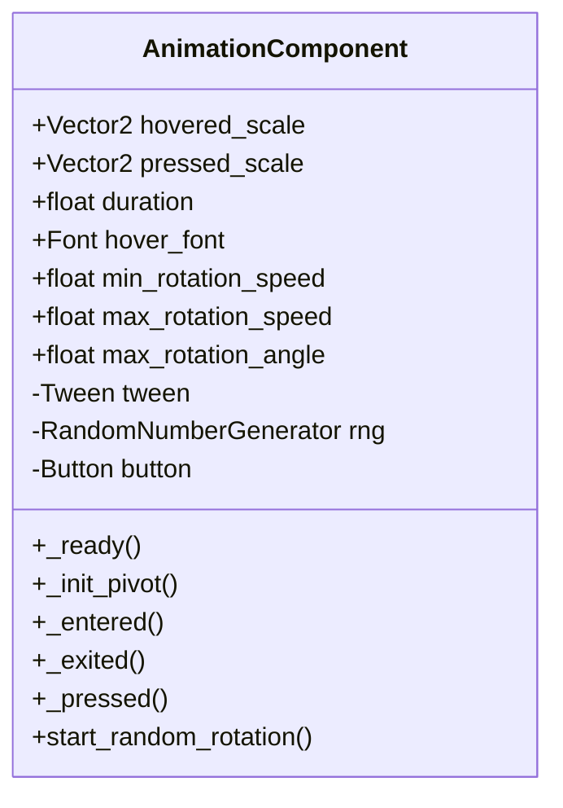
