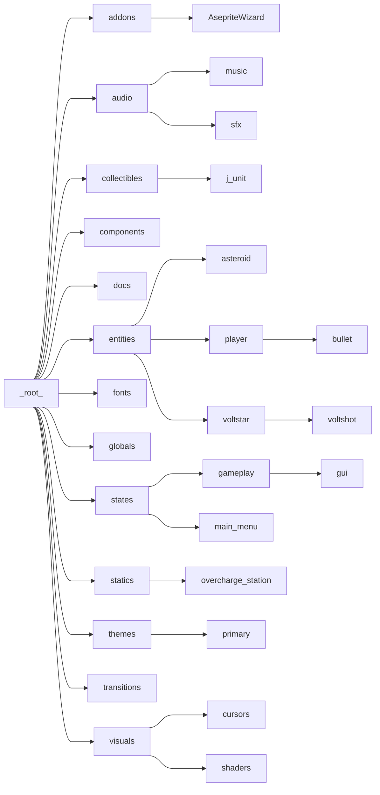
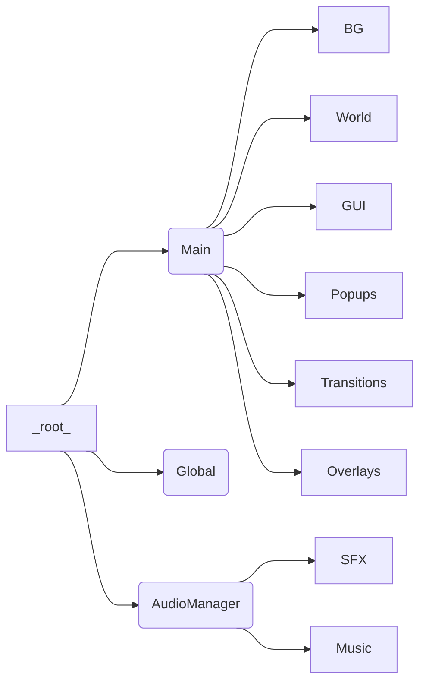

# Tree Structures

## Main File Tree

```mermaid
%%{ init: { 'flowchart': { 'curve': 'bumpX' } } }%%
flowchart LR
    r[_root_] --> addons --> AsepriteWizard
    r --> audio
    audio --> music
    audio --> sfx

    r --> collectibles --> j_unit
    r --> components
    r --> docs

    r --> e[entities]
    e --> asteroid
    e --> player --> bullet
    e --> voltstar --> voltshot

    r --> fonts
    r --> globals

    r --> states
    states --> gameplay --> gui
    states --> main_menu

    r --> statics
    statics --> overcharge_station

    r --> themes
    themes --> primary

    r --> transitions

    r --> v[visuals]
    v --> cursors
    v --> shaders
```

## Main Node Tree

```mermaid
%%{ init: { 'flowchart': { 'curve': 'bumpX' } } }%%
flowchart LR
    r[_root_] --> M(Main)
    M --> BG & World & GUI & Popups & Transitions & Overlays
    r --> G(Global)
    r --> A(AudioManager) --> SFX
    A --> Music
```
