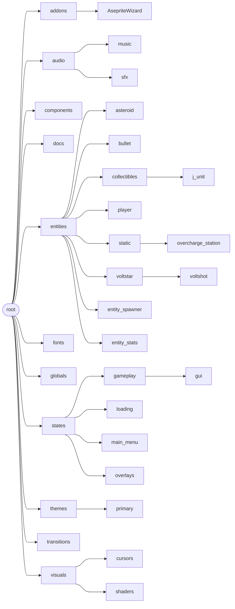
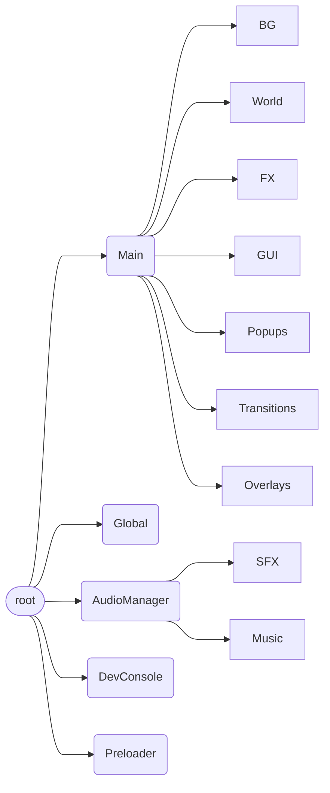

# Tree Structures

## Main File Tree

## Main Node Tree

## Scene Tree Details

| Node        | Type        | Purpose                                                   |
| ----------- | ----------- | --------------------------------------------------------- |
| Main        | Node        | Root scene controller, state transitions                  |
| BG          | CanvasLayer | Black background ColorRect                                |
| World       | CanvasLayer | Holds World2D (Node2D) — entity spawn area                |
| FX          | CanvasLayer | SpaceWarp distortion overlay (ColorRect + ShaderMaterial) |
| GUI         | CanvasLayer | MainMenu or GameplayGUI                                   |
| Popups      | CanvasLayer | Modal popups (QuitPopup)                                  |
| Transitions | CanvasLayer | Dissolve transition effect                                |
| Overlays    | CanvasLayer | VHS CRT shader overlay (ColorRect + ShaderMaterial)       |

The World and GUI subtrees are swapped on each `change_state` emission. Autoloads (Global, AudioManager, DevConsole, Preloader) persist across all transitions.
